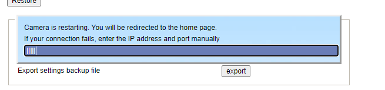
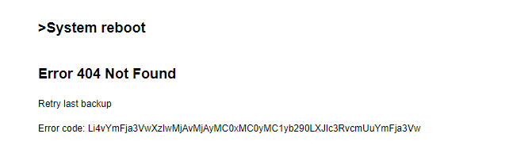
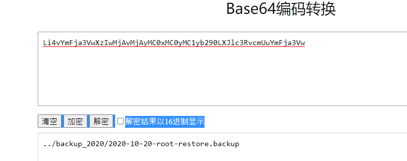
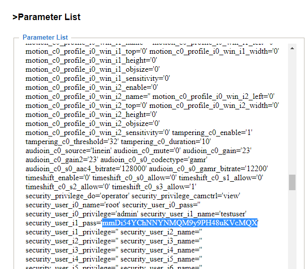

# ThuseDay Exposed webcam solv
- Write-Up Author: ed0419
- Flag: syskronCTF{why-1s-th1s-file-here?}

## Challenge Description
>We conducted an external scan of our infrastructure (e.g., IP addresses, domain names) and found an exposed webcam at [link removed as it is unavailable now]/camtest/front/cam1.
>We don't know who operates the camera at Senork. Please help us and analyze the webcam to identify the operator.
>Note: Do not use brute force, web crawlers or exploits to solve the challenge!

---
## Find the bottom & file
>We tried out all the bottom on the web page,and we found out that the reset & reboot bottom in the (maintenance page) can return an error log
>
Here is what if you press the reset bottom

Here is the result

The error code seems like a encrypt base64 code,so we decrypt it

And it return an a file path,which is

https://www.senork.de/camtest/front/cam1/backup_2020/2020-10-20-root-restore.backup
[2020-10-20-root-restore.backup](./2020-10-20-root-restore.backup)

So we can donwload the file,and use Linux command file to check the file type,and it is an a encrypt zipped file.
---
## Find the password to the zipped file
>Opened up the file,there is another zipped file in the zipped file
>So we need two passwords

We found some password in (Parameter page)

And we can find another password in the account management page
Change the html field box type=password to text,result in a plain text(dYzqmTkKv457BENsKBGSfD5vcudrXe)
---
## Use 7z to open the backup file
>You can finally get the flag by unzipping the 「backup」file.
